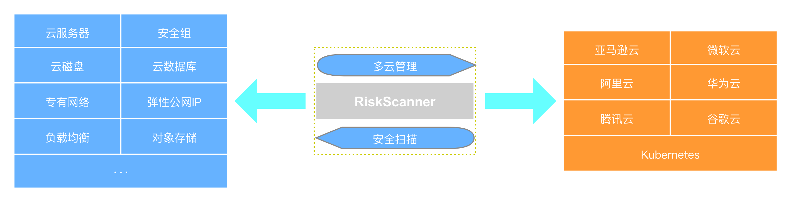
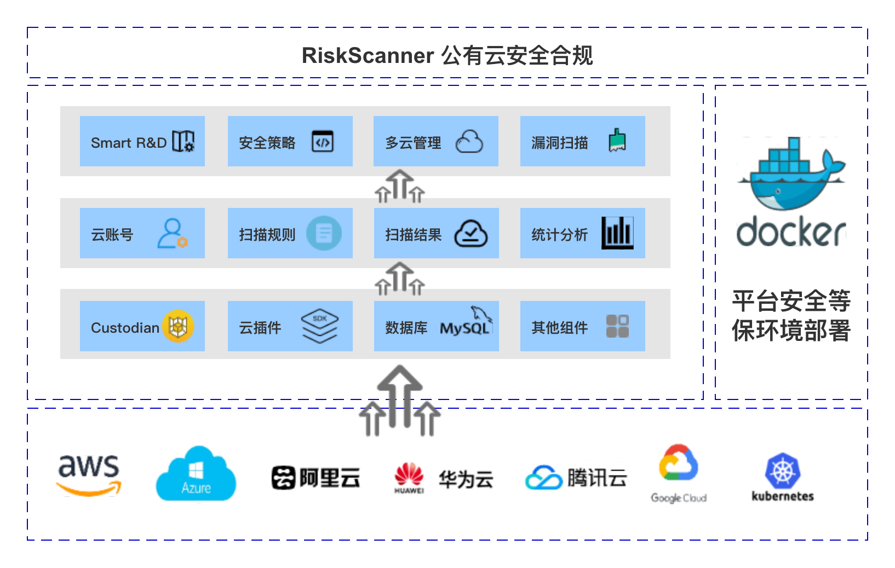
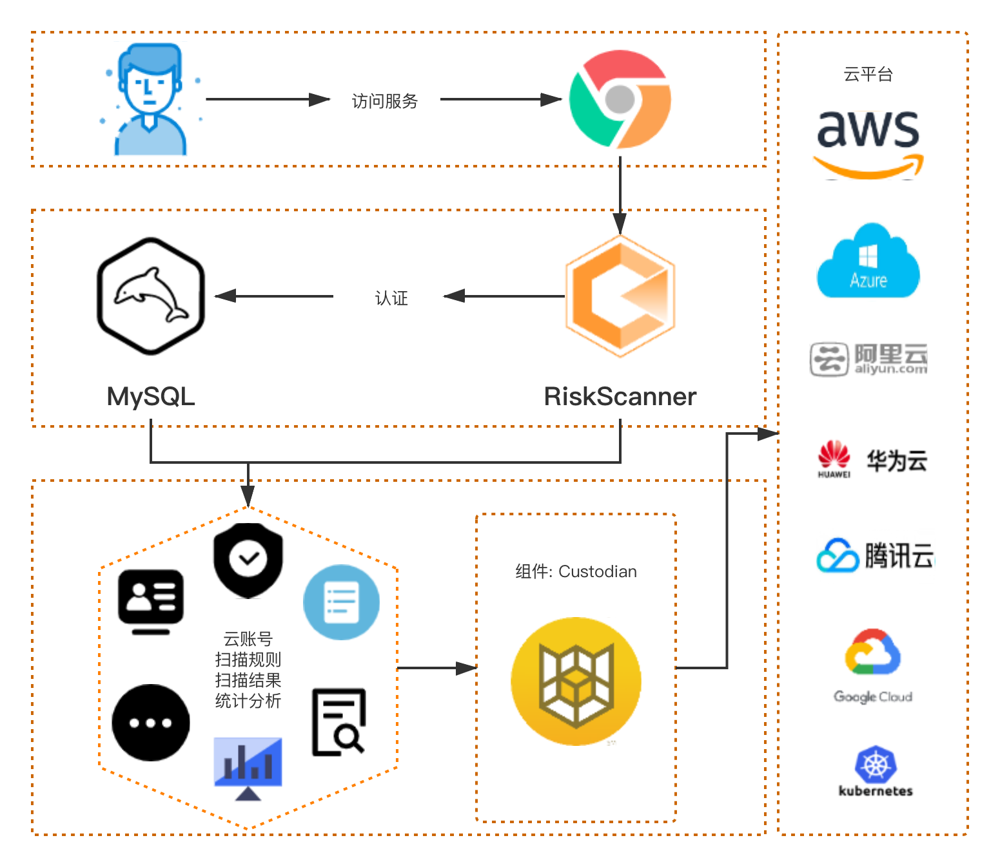
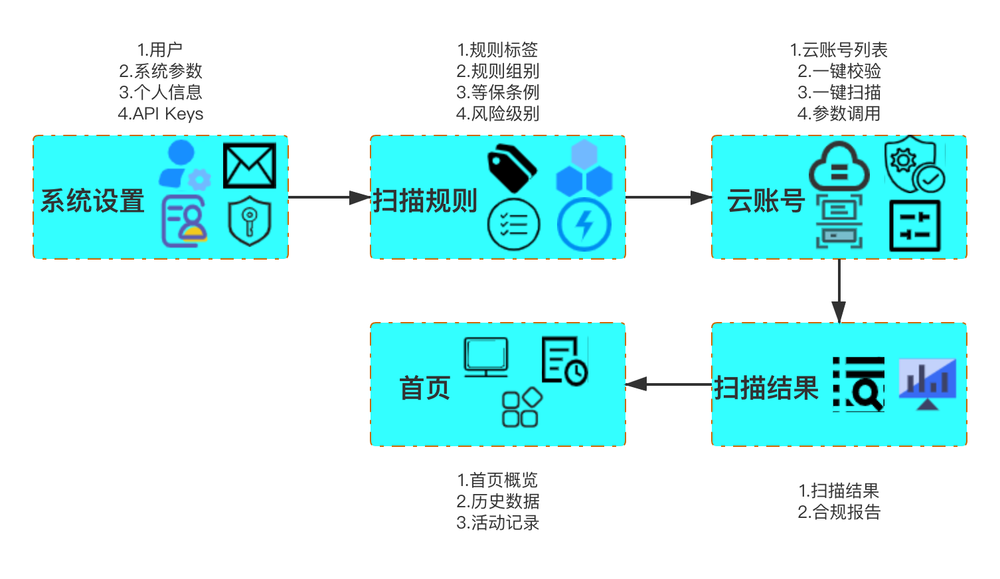

# RiskScanner 开源公有云安全合规扫描平台

[](https://www.apache.org/licenses/LICENSE-2.0)
[](https://img.shields.io/badge/License-Apache%202.0-red)
[](http://hits.dwyl.com/fit2cloudrd/fit2clolud20-risk-service.svg)

> [English](README_EN.md) | 中文

RiskScanner 是开源的公有云安全合规扫描平台，通过 Cloud Custodian 的 YAML DSL 来定义扫描规则，实现对主流公有云资源的安全合规扫描及使用优化。

RiskScanner 遵循 GPL v2 开源协议，使用 SpringBoot/Vue 进行开发，界面美观、用户体验好，支持的公有云包括阿里云、腾讯云、华为云、AWS 和 Azure等。

- 用于管理公共云帐户和资源的规则引擎。它允许用户定义策略以启用管理良好的云基础架构，既安全又优化成本。它将组织具有的许多脚本整合为一个轻量级且灵活的工具，并具有统一的指标和报告。

- 通过确保对安全策略（例如加密和访问要求），标签策略以及通过未使用资源的垃圾收集和非工作时间资源管理的成本管理的实时合规性，Compliance Service可用于管理AWS，Azure，Aliyun，Huawei，Tencent，K8s和GCP等环境。

- 设置策略以简单的YAML配置文件编写，使用户能够指定关于资源类型（EC2，ELB，EBS，ASG，AMI，RDS，VPC，S3，ECS，OSS）的策略，并由过滤器和操作的词汇表构成。

- 它与每个供应商的云本机无服务器功能集成在一起，以通过内置配置实时实施策略。或者，它可以作为简单的cron作业在服务器上运行，以针对大型现有集群执行。



## 快速开始

仅需两步快速安装 RiskScanner：
  * 操作系统: CentOS 7.x
  * CPU/内存: 4核16G
  * 磁盘空间: 100G
      
```sh
curl -sSL https://github.com/RiskScanner/riskscanner/releases/latest/download/quick_start.sh | sh
```

* 详细的离线&在线安装教程请看 [安装文档](https://rs-docs.fit2cloud.com/quick_start/)

## 帮助文档

- [帮助文档](https://rs-docs.fit2cloud.com/)

## 系统架构



## 组件说明
- Smart R&D: RiskScanner Web 基于 VUE2.6.10 、 Server 基于 SpringBoot 框架进行的开发
- 安全策略: RiskScanner 以简单的YAML配置文件编写安全策略
- 多云管理: RiskScanner 对常见公有云平台（如AWS，Azure，Aliyun，Huawei，Tencent，K8s和GCP等）进行资源扫描与管理
- 漏洞扫描: RiskScanner 由安全策略里的过滤器进行资源的漏洞扫描
- 云账号: RiskScanner 的公有云账号信息的基础配置
- 扫描规则: RiskScanner 的公有云云平台的资源扫描规则
- 扫描结果: RiskScanner 针对公有云云账号下资源的统一扫描回归数据
- 统计分析: RiskScanner 针对公有云已有的扫描结果进行统一的数据分析与展示
- Cloud-Custodian: RiskScanner 的核心组件，扫描云平台资源的规则引擎
- 云平台插件: Custodian 与公有云平台 SDK 对接的适配器
- 数据库: RiskScanner 的主要数据均存储在 MySQL
- 其他组件: 用于处理 RiskScanner 的资源数据
- Docker Engine: 各组件都是以 Docker 容器运行在节点计算机



## 使用流程



## 技术栈

- 后端: [Spring Boot](https://www.tutorialspoint.com/spring_boot/spring_boot_introduction.htm)
- 前端: [Vue.js](https://vuejs.org/)
- 中间件: [MySQL](https://www.mysql.com/)
- 基础设施: [Docker](https://www.docker.com/)

## 微信群


## License & Copyright

Copyright (c) 2014-2020 飞致云 FIT2CLOUD, All rights reserved.

Licensed under The GNU General Public License version 2 (GPLv2)  (the "License"); you may not use this file except in compliance with the License. You may obtain a copy of the License at

https://www.gnu.org/licenses/gpl-2.0.html

Unless required by applicable law or agreed to in writing, software distributed under the License is distributed on an "AS IS" BASIS, WITHOUT WARRANTIES OR CONDITIONS OF ANY KIND, either express or implied. See the License for the specific language governing permissions and limitations under the License.
