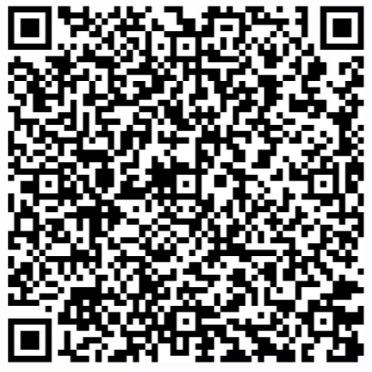

# RiskScanner 开源公有云安全合规扫描平台

[](https://www.apache.org/licenses/LICENSE-2.0)
[](https://img.shields.io/badge/License-Apache%202.0-red)
[](http://hits.dwyl.com/fit2cloudrd/fit2clolud20-risk-service.svg)

RiskScanner 是开源的公有云安全合规扫描平台，通过 Cloud Custodian 的 YAML DSL 定义扫描规则，实现对主流公有云资源的安全合规扫描及使用优化建议。

##### 功能优势：

- 等保预检：符合中国网络安全等级保护2.0的要求，全面覆盖安全审计、访问控制、入侵防范、网络架构和管理中心的网络安全检查。

- CIS合规检查：符合 CIS（Center for Internet Security）合规检查能力，监控在云上的资源是否符合 CIS Control 网络安全架构要求。

- 合规实践：制定合规管控基线，为企业级用户提供最佳实践建议，实现合规性的自主监管。

RiskScanner 遵循 GPL v2 开源协议，使用 SpringBoot/Vue 进行开发，界面美观、用户体验好，支持的公有云包括阿里云、腾讯云、华为云等。

##### 技术优势：

- 规则简单灵活：扫描规则是简单的 YAML 格式，并允许用户自定义规则。

- 支持多平台：支持的公有云包括阿里云、腾讯云、华为云等。

- 支持多资源：支持的资源类型包括云服务器、云磁盘、云数据库、负载均衡、对象存储、专有网络、安全组等。

- 界面易操作: 界面美观、用户体验好，易于操作和管理。

## UI 界面展示


## 快速开始

仅需两步快速安装 RiskScanner：
  * 操作系统: CentOS 7.x
  * CPU/内存: 4核16G
  * 磁盘空间: 100G
      
```sh
curl -sSL https://github.com/RiskScanner/riskscanner/releases/latest/download/quick_start.sh | sh
```

## 帮助文档

- [帮助文档](https://rs-docs.fit2cloud.com/)

## 微信群


## QQ群



## 系统架构


## 技术栈

- 后端: [Spring Boot](https://www.tutorialspoint.com/spring_boot/spring_boot_introduction.htm)
- 前端: [Vue.js](https://vuejs.org/)
- 中间件: [MySQL](https://www.mysql.com/)
- 基础设施: [Docker](https://www.docker.com/)


## License & Copyright

Copyright (c) 2014-2020 飞致云 FIT2CLOUD, All rights reserved.

Licensed under The GNU General Public License version 2 (GPLv2)  (the "License"); you may not use this file except in compliance with the License. You may obtain a copy of the License at

https://www.gnu.org/licenses/gpl-2.0.html

Unless required by applicable law or agreed to in writing, software distributed under the License is distributed on an "AS IS" BASIS, WITHOUT WARRANTIES OR CONDITIONS OF ANY KIND, either express or implied. See the License for the specific language governing permissions and limitations under the License.
