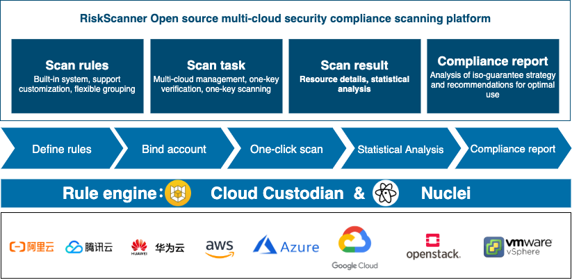
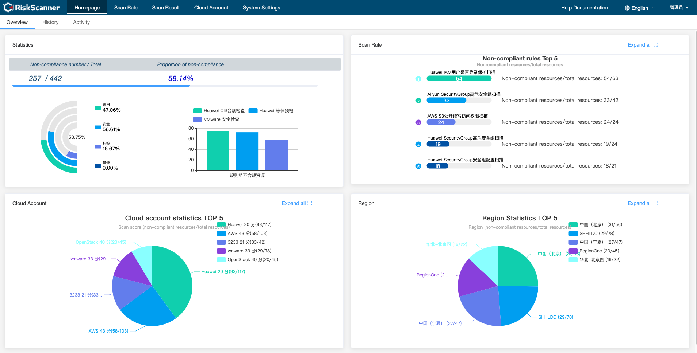

<p align="center"><a href="https://riskscanner.io"></a></p>
<h3 align="center">Open source multi-cloud security compliance scanning platform <a href="https://github.com/riskscanner/riskscanner/blob/master/README.md">[Chinese Version]</a></h3>

<p align="center">
  <a href="https://app.codacy.com/gh/riskscanner/riskscanner?utm_source=github.com&utm_medium=referral&utm_content=riskscanner/riskscanner&utm_campaign=Badge_Grade"></a>
  <a href="https://www.gnu.org/licenses/old-licenses/gpl-2.0"></a>
  <a href="https://github.com/riskscanner/riskscanner/releases/latest"></a>
  <a href="https://github.com/riskscanner/riskscanner"></a>
  <a href="https://github.com/riskscanner/riskscanner/releases"></a>
</p>
<hr />

RiskScanner is an open source multi-cloud security compliance scanning platform, Based on Cloud Custodian、Prowler and Nuclei engines, it realizes security compliance scanning and vulnerability scanning of mainstream public (private) cloud resources.

**Functional advantage**

> - [x] Hierarchical protection 2.0 pre-inspection: Comply with Hierarchical Protection 2.0 specifications, covering various inspections such as security audit, access control, intrusion prevention, network architecture and management center.
> - [x] CIS compliance inspection: In compliance with CIS specifications, check and real-time monitor whether resources on the cloud meet CIS requirements.
> - [x] Vulnerability scan: Based on the vulnerability rule library, the security vulnerabilities of designated network equipment and application services are detected through scanning and other means.
> - [x] Best practice recommendations: Develop a compliance control baseline, provide best practice recommendations for enterprise-level users, and continue to improve the level of compliance.

RiskScanner follows the GPL v2 open source agreement and uses SpringBoot/Vue for development. The interface is beautiful and the user experience is good. The supported public clouds include Alibaba Cloud, Tencent Cloud, Huawei Cloud, Amazon Web Services, Microsoft Azure, Google Cloud, and the supported private clouds include OpenStack, VMware vSphere, etc, and supports vulnerability scanning.

**Technical advantages**

> - [x] Simple and flexible rules: scanning rules adopt simple YAML format, which is easy to understand and allows users to customize rules.
> - [x] Support multiple public (private) clouds: Supported public clouds include Alibaba Cloud, Tencent Cloud, Huawei Cloud, Amazon Web Services, Microsoft Azure, Google Cloud, and supported private clouds include OpenStack, VMware vSphere, etc.
> - [x] Support multiple resource types: Supported resource types include cloud servers, cloud disks, cloud databases, load balancing, object storage, private networks, security groups, etc.
> - [x] Rich and comprehensive vulnerability rule library: Covers OWASP TOP 10 Web vulnerabilities, such as: SQL injection, cross-site scripting (XSS), cross-site request forgery (CSRF), weak passwords, etc.



## UI interface display



## Quick start

Quick installation in just two steps：

1.  Prepare a 64-bit Linux host with more than 4 G of RAM.
2.  As the root user, execute the following commands to install RiskScanner with one click.

```sh
curl -sSL https://github.com/riskscanner/riskscanner/releases/latest/download/quick_start.sh | sh
```

## Help document and demo video

> [Help document](https://docs.riskscanner.io/)

> [Demo video](https://www.bilibili.com/video/BV12p4y1b7Ud)

## WeChat group


## Technology stack

- Front end：[Vue.js](https://vuejs.org/)
- Rear end：[Spring Boot](https://www.tutorialspoint.com/spring_boot/spring_boot_introduction.htm)
- Cloud platform scan engine：[Cloud Custodian](https://github.com/cloud-custodian/cloud-custodian)
- AWS scan engine：[Prowler](https://github.com/toniblyx/prowler)
- Vulnerability Scan Engine：[Nuclei](https://github.com/projectdiscovery/nuclei)
- Database：[MySQL](https://www.mysql.com/)

## License & Copyright

Copyright (c) 2014-2021 FIT2CLOUD, All rights reserved.

Licensed under The GNU General Public License version 2 (GPLv2) (the "License"); you may not use this file except in compliance with the License. You may obtain a copy of the License at

https://www.gnu.org/licenses/gpl-2.0.html

Unless required by applicable law or agreed to in writing, software distributed under the License is distributed on an "AS IS" BASIS, WITHOUT WARRANTIES OR CONDITIONS OF ANY KIND, either express or implied. See the License for the specific language governing permissions and limitations under the License.
